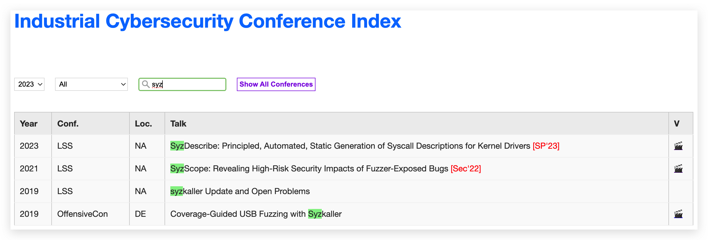

# Industrial Cybersecurity Conference Index

## Introduction



In recent years, more and more researches in the cybersecurity field are published on both academic and industrial conferences. And it is more frequent than before that one accepted academic paper is inspired by a known issue or technique in industry and community. That is, the academic researchers conduct **systematical** investigations for analysis, discovery, automation and security defense. As a result, industrial researches serve as invaluable potential and inspiration.

However, there is no such an index for industrial conference talks yet, with which we can aggregate and present the information in an intuitive way. For example, search for eBPF related talks across top industrial security conferences. Of course, there are awesome conference databases available on the Internet, but extra work is needed when you want to have a quick look for existing researches on a specific topic. Sometimes you will get confused and lose yourself in the sea of knowledge.

To satisfy this demand, I choose to develop and maintain the **Industrial Cybersecurity Conference Index (ICCI)**, available at [**sec.wohin.me**](https://sec.wohin.me). You are welcome to visit ICCI and search for industrial cybersecurity researches related to your own work. Pull requests are acceptable!

I hope ICCI makes your research more efficient and interesting. If you find it useful, you can [buy me a coffee](https://www.buymeacoffee.com/wohin) to support me and this project. Thank you! Have a good time!

## Integrated Conferences

|      | BH   | HITB       | OFF | POC  | RE | LSS   |
| ---- | ---------- | ---------- | ------------ | ---- | ----- | ----- |
| 2017 | US \| ASIA \| EU |  AMS          |              |      |       |       |
| 2018 | US \| ASIA \| EU | AMS \| BJ \| DXB | DE           |      |       |       |
| 2019 | US \| ASIA \| EU | AMS        | DE           |      |       | NA \| EU |
| 2020 | US \| ASIA \| EU | AMS \| SG     | DE           |      |       | NA \| EU |
| 2021 | US \| ASIA \| EU | AMS \| SG     |              |      |       | NA    |
| 2022 | US \| ASIA \| EU | SG         | DE           | KR   | MTL   | NA \| EU |
| 2023 | US \| ASIA \| EU | AMS \| HKT    | DE           | KR   | MTL   | NA \| EU |

Note:

```
BH = BlackHat
OFF = OffensiveCon
RE = REcon
LSS = Linux Security Summit
```

